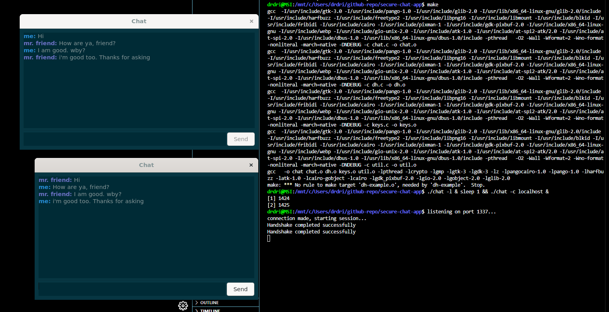

# Secure Chat App

A terminal-based encrypted chat application built in C using GTK and OpenSSL. This project demonstrates a basic yet functional encrypted communication system over TCP sockets using Diffie-Hellman key exchange for secure session establishment.

##  Features

- Encrypted chat communication using OpenSSL
- Diffie-Hellman key exchange for session key generation
- GUI built with GTK (via `layout.ui`)
- Lightweight, runs entirely in terminal or X11 window environment
- Supports both client and listener/server modes

##  Encryption Details

- **Key exchange**: Diffie-Hellman (DH)
- **Session encryption**: AES (through OpenSSL EVP API)
- **Key management**: Keys generated per session; not stored

##  Directory Structure

```
secure-chat-app/
├── src/               # Source code (C files)
├── screenshots/       # UI or terminal usage screenshots
├── layout.ui          # GTK UI design file
├── colors.css         # Optional CSS styles for GTK
├── Makefile           # For compiling the project
├── .gitignore
├── LICENSE
├── chat               # Compiled binary (after build)
└── README.md
```

##  Installation & Compilation

###  Requirements

- Linux or WSL (Windows Subsystem for Linux)
- GCC compiler
- OpenSSL development libraries
- GTK 3 development libraries

###  Build Steps

```bash
sudo apt update
sudo apt install build-essential libssl-dev libgtk-3-dev
cd secure-chat-app
make
```

>  If you’re on Windows, install WSL (e.g., Ubuntu) and follow the same instructions inside the WSL terminal.

##  Usage

After building:

```bash
# Terminal 1 (listener)
./chat -l

# Terminal 2 (client)
./chat -c localhost
```

You can run both in the same terminal (for testing) like this:

```bash
./chat -l & sleep 1 && ./chat -c localhost
```

This launches one terminal in listener mode, then connects another to it as client.

##  Screenshot



##  License

This project is licensed under the MIT License. See [LICENSE](LICENSE) for details.

##  Acknowledgements

- GTK for the GUI framework
- OpenSSL for cryptographic functionality
- Inspired by practical needs for lightweight secure messaging in controlled environments
